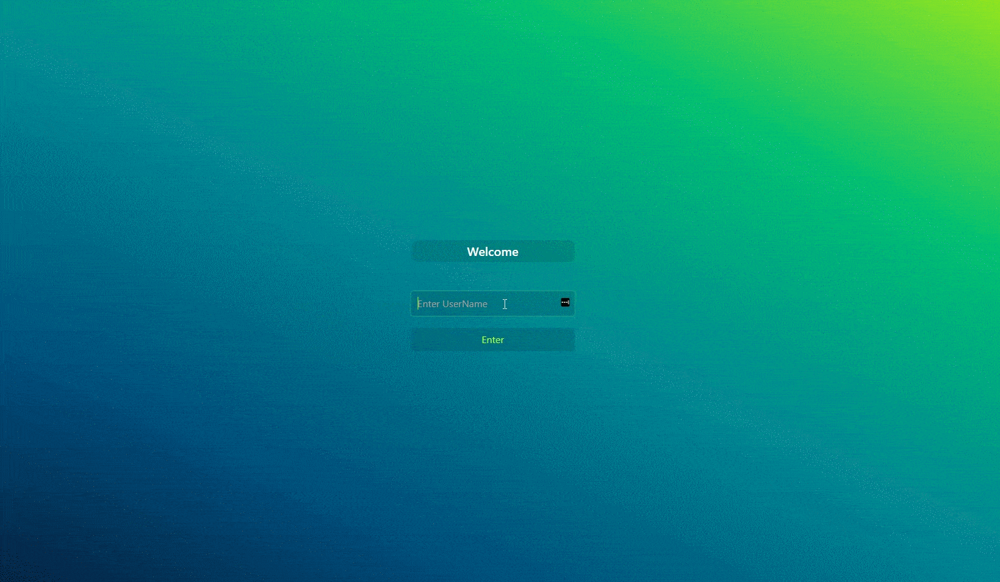
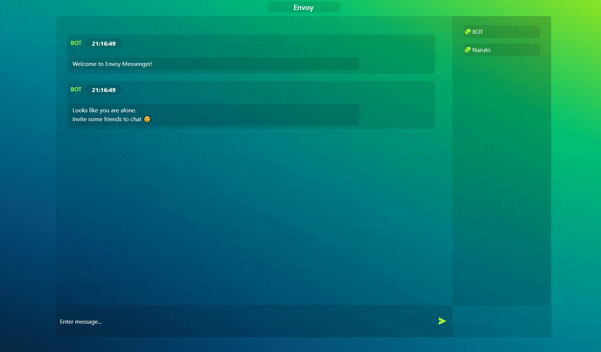

# Envoy [(Live Demo)](https://narutovps-envoy.herokuapp.com/)

> Simple web based messaging app built with nodejs.

## Table of Contents

- [Features](#features)
- [How To Use](#how-to-use)
- [Contributing](#contributing)
- [Credits](#credits)
- [License](#license)

## Features

 - Real time messaging
 - Chat Room Support
 - Database Support
 - Shows status of other users (joined, online or left)
 - Super easy to use
 


## How To Use

> Make sure you have node & mongodb installed in your system.
> Clone the repository, open terminal in the diretory and type the following command

```shell
$ npm install
$ node server.js
```

> Now open your broswer and go to the following address

```shell
http://localhost:8080/
```

---

## Contributing

> To contribute 

### Step 1

- **Option 1**
    - 🍴 Fork this repo!

- **Option 2**
    - 👯 Clone this repo to your local machine using `https://github.com/NarutoVPS/Envoy.git`

### Step 2

- ⛓ Create a new branch with meaningful name 

## Step 3

- **Do your Stuff!** 🔨🔨🔨

### Step 4

- 🔃 Create a new pull request 

---

## Credits

- [Inffinite](https://github.com/Inffinite) -> Major UI Improvements 

---

## License

[](http://badges.mit-license.org)

- **[MIT license](http://opensource.org/licenses/mit-license.php)**


